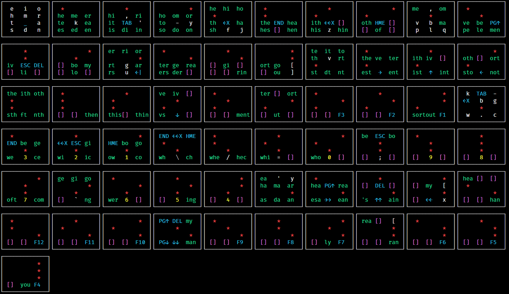

# twiddler-oran-layout

An AI Generated Twiddler Layout Optimised for Multi Character Chords

## Just the Files Please

Sure:
- [twiddler.cfg](twiddler.cfg)
- [Layout exported to CSV](twiddler_cfg_oran.csv)

## What Is A Twiddler?

A [Twiddler](https://twiddler.tekgear.com/) is a wearable one-handed chord keyboard. When strapped to one's palm, the fingers can access twelve buttons in a three by four grid. The thumb can reach four modifier keys: Num, Alt, Ctrl and Shift. You use combinations of these buttons to emulate a full-sized keyboard.

Unlike a typical keyboard, output is produced when you release keys, not when you press them. This is necessary to allow you to hold down multiple keys.

## Why Do You Use One?

I picked up some tendon damage to my right hand in my 20's. I've had an interest in alternative input devices ever since.

## Multi Character Chords

As there are 254 possible combinations of these buttons, there is scope for additional functionality when compared to a typical 102 key keyboard. You could, say, store your e-mail or postal address as a single combination of keys if it's something you find you type often. Personally I find autofill and my IDE covers snippets like this quite well so I don't use this approach.

What to do with all these extra slots then?

English is predictable. 'Th' comes up often, as does 'he'. It's fairly easy to get a list of common two, three, and four letter combinations in use in the English language, and these are great candidates for storing in unused key combinations.

Mind you, having to memorise 254 combinations and their associated snippets of words is not something I would rush to recommend.

We can simplify this with the following plan:

- Give the twelve most frequently used characters the easiest chords, i.e. a single key press.
- Arrange them in such a fashion as it's possible to press the relevant two, three, and four letter combinations at the same time.

You'll note from the layout that one of the four button columns produces 't', 'h', 'e', and 's' when individual buttons are pressed. It also produces the following multi character snippets when we press buttons in combination:

| Letters used | Output when pressed together |
| ------------ | ---------------------------- |
| t + h        | th                           |
| h + e        | he                           |
| t + h + e    | the                          |
| t + e        | te                           |
| e + s        | es                           |
| h + e + s    | hes                          |
| s + t        | st                           |
| e + s + t    | est                          |
| s + t + h    | sth                          |

This gives us nine frequently used snippets of English text in an easy to remember format. Typing them in this fashion is significantly faster than pressing and releasing the individual keys.

## Taking it Further - Generating the Layout

The number of potential layouts we could create to occupy the potential 254 available chord combinations is staggering, and making an optimised one with pen and paper (so to speak) would be intractable. Instead I used a genetic algorithm.

I'll put together a separate repo for the code I used to generate the layout, but the broad strokes were:

- Get a list of frequently used two, three, and four letter combinations of characters
- Generate hundreds of layouts
- Score each layout by determining how many high value combinations of characters are possible / how complex it is to press the keys
- Kill off the low scoring layouts, replacing them with mutations of the high scoring layouts
- Repeat until the top score stops changing for several generations

## The Layout

### Interpreting the Layout

#### Colours used

| Colour | Meaning                               |
| ------ | ------------------------------------- |
| White  | Letter, punctuation, brace            |
| Blue   | Navigation, whitespace, function keys |
| Green  | Multi character output                |
| Yellow | Numbers                               |
| Purple | Unassigned chord                      |
| Red    | Indicates an activated key            |

#### One button chords

The top left grid shows the result from pressing individual buttons and is the easiest to interpret. What you see is what you get.

#### Representing activated keys

A red asterisk (*) indicates that the key in question is being held down. The rest of the grid indicates what output will be produced if the key at that location is also pressed.

#### Special keys

For reasons of space and readability some symbols are changed. Details below:

| Symbol | Meaning                               |
| ------ | ------------------------------------- |
| ←X     | Backspace                             |
| ←←X    | Ctrl + Backspace (Delete entire word) |
| ↑      | Up arrow                              |
| PG↑    | Page up                               |
| →      | Right arrow                           |
| ↓      | Down arrow
| PG↓    | Page down
| ←      | Left arrow
| ↑↑     | Ctrl + up arrow
| →→     | Ctrl + right arrow (Right one word)
| ↓↓     | Ctrl + down arrow
| ←←     | Ctrl + left arrow (Left one word)
| ←|     | Enter
| PSC    | Print Screen
| DEL    | Delete
| ESC    | Escape
| HME    | Home
| END    | End
| TAB    | Tab
| CAP    | Caps Lock
| _      | Space bar                             |